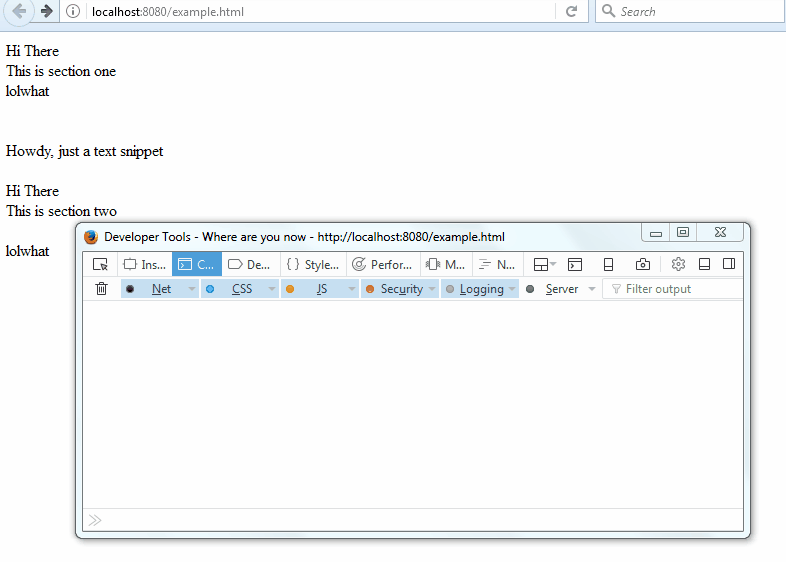

# Where Are You Now

This is a useful UI debugging library to discover all the faded (`display:none`) elements on your page. 



## Usage

### In your own code
Make sure you've included jquery on your page. Simply download where-are-you-now.js and add it via the following snippet

```html
<script src="path/to/where-are-you-now.js"></script>
```

Open up console and type in `whereAreYouNow()` to get the yellow dialogs that point to where the elements' positions would be were they not hidden.

To remove all the dialogs, just execute `$(".where-are-you-now").remove()` from the console. 

Note that all the pointers point to top and left of the hidden element, except when element's top is less than 15px from top in which case it points to 15px from the top so that the dialog doesn't get cut off.

The library is also a jquery plugin, so if you want to see the dialogs for only a subset of your page, you can try

`$(".my-selector").whereAreYouNow()` and it'd reveal locations of all elements within `.my-selector`.

### On other pages

Include the following snippet on the page you want to debug but whose source you don't want to tinker around with:

```js
	// if page has jquery
	fetch('<insert rawgit here>')
		.then(response => response.text())
		.then(text => eval(text))

	// if the page doesn't have jquery
	fetch('https://code.jquery.com/jquery-3.1.1.min.js')
		.then(response => response.text())
		.then(text => eval(text))
		.then(x => fetch('<insert rawgit here>'))
		.then(response => response.text())
		.then(text => eval(text))
```

## License

MIT License